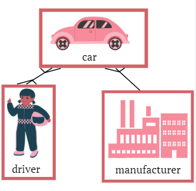
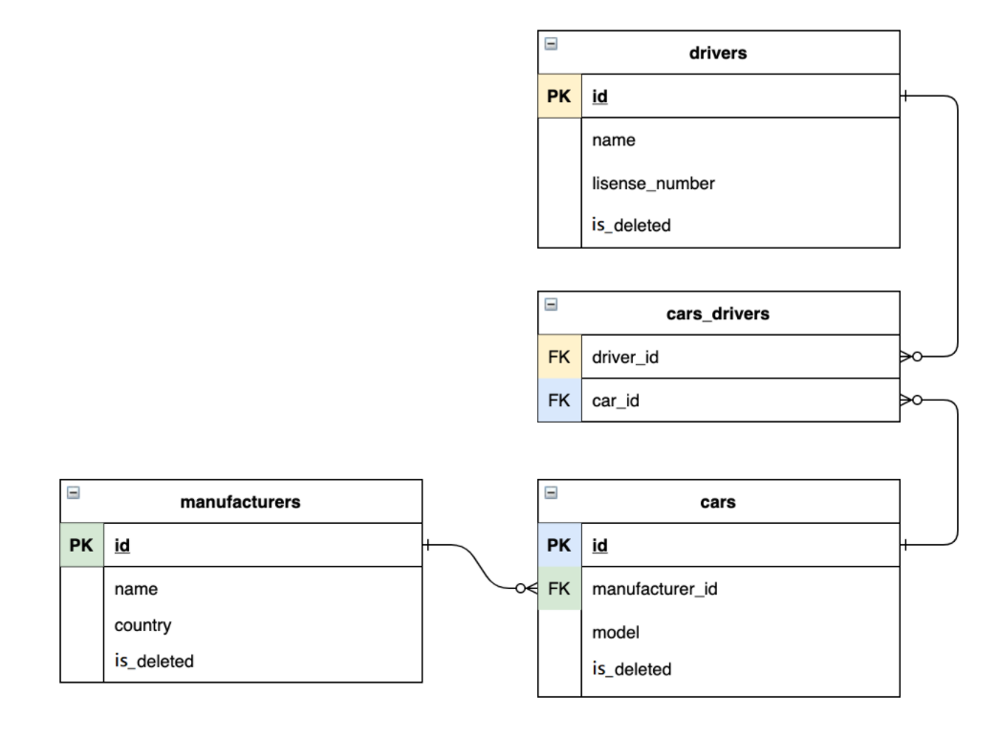

# Readme:
## What is the project?
This is my first web project, which has done me practise to construct programs 
as a N-tier architecture with web-technologies (Servlets and JDBC). 
Itself is an emulation of a taxi service.

Examples of code:
```java
package basesyntax.controller;

import java.io.IOException;
import javax.servlet.ServletException;
import javax.servlet.http.HttpServlet;
import javax.servlet.http.HttpServletRequest;
import javax.servlet.http.HttpServletResponse;
import javax.servlet.http.HttpSession;

public class IndexController extends HttpServlet {
    private static final String DRIVER = "driver";
    private static final String NAME = "name";

    @Override
    protected void doGet(HttpServletRequest req, HttpServletResponse resp)
            throws ServletException, IOException {
        HttpSession session = req.getSession();
        req.setAttribute(DRIVER, session.getAttribute(NAME));
        req.getRequestDispatcher("/WEB-INF/views/index.jsp").forward(req, resp);
    }
}
```

## Run online version - deployment on Heroku:
- please follow the [link](https://serhii-orlov.herokuapp.com/login")
- use standard login and password: 'root' and 'root'.
- check workability the site follow the instructions.

## Inside structure of project:
This project - emulation of taxi service. Picture, which demonstration of workflow:

       

For users, which have an account, propose the next futures:
- Display all cars, drivers and manufacturers 
- Create new cars, drivers and manufacturers 
- Delete cars, drivers and manufacturers 
- Add cars to drivers 
- Display all cars for current driver 

### Structure of DataBase you can see bellow:


## Requires to getting start:
- TomCat - 9.0.54 (not 10.* and above)
- DataBase - MySql (ver. 8.*) 
- Insert your access data in class basesyntax.util.ConnectionUtil.java
- Run the TomCat and follow instruction.
